# Wizard Editor

A native macOS video editor built in **Rust + egui + wgpu**, targeting Apple Silicon with a Metal backend. Two-panel architecture (media browser + timeline) with real-time video playback, audio mixing, GPU-accelerated waveforms, and 60fps rendering — all from a single cross-platform codebase.

**~8,500 lines of Rust** across 5 crates. No Electron. No native OS widgets. Pure GPU-rendered UI.

---

## Table of Contents

- [Architecture Overview](#architecture-overview)
- [Crate Dependency Graph](#crate-dependency-graph)
- [Brief Compliance Matrix](#brief-compliance-matrix)
- [Part 1 — Media Browser](#part-1--media-browser)
- [Part 2 — Timeline](#part-2--timeline)
- [Part 3 — Make Them Talk](#part-3--make-them-talk)
- [Bonus Features](#bonus-features)
- [Beyond the Brief](#beyond-the-brief)
- [Threading Model](#threading-model)
- [Playback Pipeline Deep Dive](#playback-pipeline-deep-dive)
- [Audio System Architecture](#audio-system-architecture)
- [60fps Frame Budget](#60fps-frame-budget)
- [State Management](#state-management)
- [Building & Running](#building--running)
- [Tech Stack](#tech-stack)

---

## Architecture Overview

```
┌──────────────────────────────────────────────────────────────────────┐
│                        wizard-app (binary)                           │
│                                                                      │
│  ┌──────────┐  ┌───────────┐  ┌────────────┐  ┌──────────────────┐  │
│  │  eframe  │  │  EditorApp │  │  Pipelines │  │  Worker Threads  │  │
│  │  window  │──│  run loop  │──│  fwd/rev/  │──│  preview (x3)    │  │
│  │  + wgpu  │  │  60fps     │  │  shadow    │  │  video decode    │  │
│  └──────────┘  └─────┬──────┘  └────────────┘  │  audio preview   │  │
│                      │                           │  folder watcher  │  │
│                      │                           │  import (per file│) │
│                      │                           └──────────────────┘  │
├──────────────────────┼────────────────────────────────────────────────┤
│                      │                                                │
│  ┌──────────────┐    │    ┌──────────────────┐                       │
│  │  wizard-ui   │◄───┘───►│  wizard-media    │                       │
│  │              │         │                  │                       │
│  │  browser     │         │  decoder (ffmpeg)│                       │
│  │  timeline    │         │  pipeline        │                       │
│  │  preview     │         │  thumbnail       │                       │
│  │  theme       │         │  waveform        │                       │
│  │  waveform_gpu│         │  import          │                       │
│  └──────┬───────┘         └────────┬─────────┘                       │
│         │                          │                 ┌──────────────┐ │
│         │    ┌──────────────┐      │                 │ wizard-audio │ │
│         └───►│ wizard-state │◄─────┘                 │              │ │
│              │              │                         │ cpal output  │ │
│              │  clips       │                         │ ring buffer  │ │
│              │  timeline    │                         └──────────────┘ │
│              │  playback    │                                         │
│              │  selection   │                                         │
│              │  tags        │                                         │
│              └──────────────┘                                         │
└──────────────────────────────────────────────────────────────────────┘
```

---

## Crate Dependency Graph

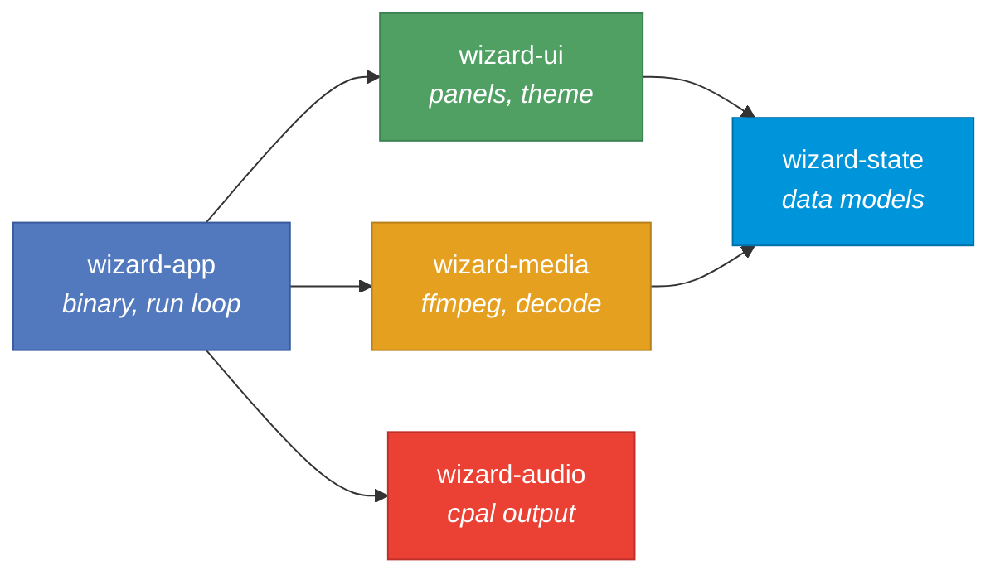

Five crates with strict, acyclic dependencies:

| Crate | Role | Lines | Key Dependencies |
|-------|------|-------|------------------|
| **wizard-app** | Binary entry point, run loop, orchestration | ~2,400 | eframe, egui, notify, ringbuf |
| **wizard-state** | Shared data models, no UI or media deps | ~1,300 | uuid (only) |
| **wizard-ui** | All egui panel rendering | ~2,500 | egui, egui-wgpu, wgpu, rfd |
| **wizard-media** | FFmpeg decoding, thumbnails, pipelines | ~2,100 | ffmpeg-the-third, image, ringbuf |
| **wizard-audio** | cpal audio device output | ~160 | cpal, ringbuf |

The state crate depends on nothing but `uuid` — any crate can read/write state without pulling in media or UI. This makes it trivial to add a fourth panel (or a tenth) without touching the state layer.

---

## Brief Compliance Matrix

### Part 1 — Media Browser

| Requirement | Status | Implementation |
|-------------|--------|----------------|
| Import a folder of video clips | Done | Native file dialog (rfd), recursive folder scan, live folder watching via `notify` for hot-reload of new files |
| Display thumbnails in a grid | Done | Async extraction via ffmpeg on background threads, GPU texture upload, responsive grid layout that adapts to panel width |
| Preview on hover with audio | Done | 32-frame preview strips generated by 3-thread worker pool, scrub-on-hover with mouse position mapped to frame index, audio snippets decoded on background thread with fade-in/out |
| Support tagging/starring clips | Done | Right-click context menu: star toggle + 4 tag categories (B-Roll, VO, Music, SFX) stored as bitmask. Visual star badge on thumbnails |
| Search bar + metadata filter | Done | Full-text search across filename, codec, resolution, duration, and tags. Starred-only toggle. Tag filter dropdown. 5 sort modes (import order, name, duration, resolution, file type) with asc/desc |
| Drag clip to timeline | Done | Multi-select drag with visual count badge, ghost preview at cursor, snaps to clip boundaries on drop |

### Part 2 — Timeline

| Requirement | Status | Implementation |
|-------------|--------|----------------|
| 3+ video/audio tracks | Done | Default 3 paired V/A tracks, dynamically add/remove pairs, reorder track pairs via context menu |
| Clip thumbnails on video tracks | Done | Thumbnail rendered inline at left edge of clip, center-cropped to fit track height |
| Audio waveforms on audio tracks | Done | Pre-computed at import (512 peak buckets), GPU-accelerated rendering via custom wgpu shader, CPU fallback |
| Drag-to-reorder clips | Done | Same-track and cross-track moves with snapping, linked V/A pairs move together, overlap resolution (auto-trim/split) |
| Playhead scrubbing | Done | Red playhead with ruler triangle, click/drag on ruler, snaps to clip edges within 10px threshold |
| J-K-L playback controls | Done | J = reverse (1x/2x/4x), K = stop, L = forward (1x/2x/4x), Space = toggle. Speed shown below |
| 60fps, no stuttering | Done | 16.6ms frame budget. All decode/IO on background threads. Non-blocking channel polling. Shadow pipeline prefetches next clip. Fallback decoder for stall recovery |

### Part 3 — Make Them Talk

| Requirement | Status | Implementation |
|-------------|--------|----------------|
| Drag from browser to timeline track | Done | Drop target detection per track, audio-only clips route to audio tracks, sequential placement for multi-select drops |
| Selecting timeline clip highlights in browser | Done | Shared `Selection` state: `selected_timeline_clip` maps back to `source_id` (library ClipId) |
| Playing timeline shows frame in preview | Done | Full decode pipeline: playhead position -> timeline clip lookup -> source time mapping -> ffmpeg decode -> GPU texture -> preview panel |
| Starring in browser flags on timeline | Done | Star state lives in `ProjectState.starred` (HashSet), both browser and timeline read from same source |

### Bonus

| Requirement | Status | Implementation |
|-------------|--------|----------------|
| GPU-accelerated waveform rendering | Done | Custom wgpu render pipeline: vertex shader generates bar geometry from storage buffer, fragment shader applies amplitude-based brightness modulation |
| Dark UI, professional look | Done | Custom theme: 15+ color constants (dark backgrounds, cyan accent, red playhead, yellow stars), 4px rounding, consistent spacing |
| Basic trim on clip edge | Done | Left/right edge handles (12px hit zone), drag to adjust in/out points, clamped to source bounds, linked clips sync automatically, overlap auto-resolution |

---

## Part 1 — Media Browser

### Import Pipeline

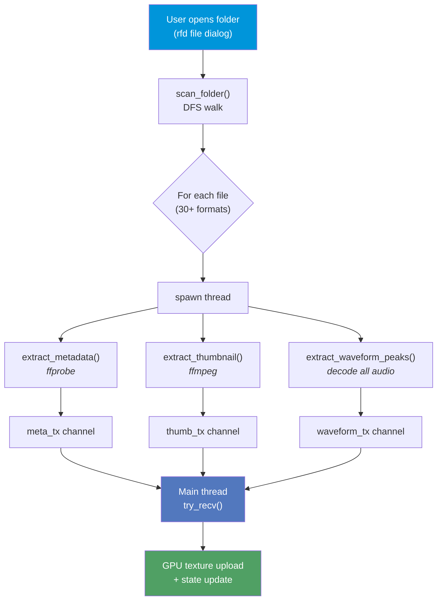

```
User drags folder ──► rfd file dialog
                         │
                         ▼
              scan_folder() DFS walk
              (30+ video/audio formats)
                         │
                    per file:
                    ┌────┴────┐
                    ▼         │
              spawn thread    │
                    │         │
         ┌─────────┼─────────┤
         ▼         ▼         ▼
     metadata   thumbnail   waveform
     (ffprobe)  (ffmpeg)    (decode all audio)
         │         │         │
         ▼         ▼         ▼
      meta_tx   thumb_tx   waveform_tx
      channel   channel    channel
         │         │         │
         └────┬────┘─────────┘
              ▼
        Main thread (try_recv)
              │
              ▼
        GPU texture upload
        + state update
```

After initial import, a `notify` file watcher monitors the folder recursively — new files dropped into the folder appear automatically without re-importing.

### Thumbnail Generation

- Extracts a single keyframe at 480x270
- Tries 7 timestamps in order: `[0.5s, 1.0s, 2.0s, 0.0s, 0.04s, 0.25s, 5.0s]`
- Black frame detection: samples ~200 pixels, skips if >90% are dark (R+G+B < 30)
- Falls back gracefully for audio-only files (music note placeholder)

### Hover Preview

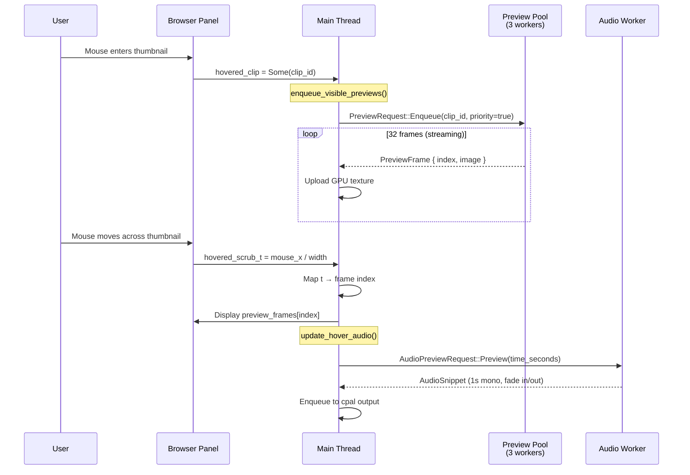

3-worker thread pool generates 32 evenly-spaced frames (240x135) per clip. Frames stream to the main thread as they decode — no waiting for all 32. Mouse X position over the thumbnail maps directly to frame index for instant scrubbing.

Audio preview: background thread decodes 1-second mono snippet at the hovered timestamp, applies 10ms fade-in/out to prevent clicks, enqueues to cpal output.

### Search & Filter

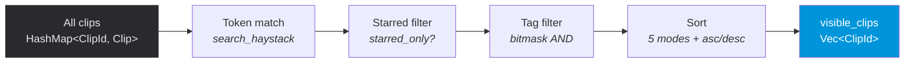

`filtered_clips()` is the single source of truth for what the browser displays. It chains:
1. Full-text token matching against a pre-computed `search_haystack` (filename + codec + resolution + duration + tags, all lowercase)
2. Starred-only toggle
3. Tag bitmask filter (AND logic)
4. Sort by import order / name / duration / resolution / file type, ascending or descending

---

## Part 2 — Timeline

### Track System

```
┌─────────────────────────────────────────────────────────────┐
│ Ruler  │ 0:00    0:01    0:02    0:03    0:04    0:05      │
├────────┼────────────────────────────────────────────────────┤
│   V3   │                                                    │
├────────┼────────────────────────────────────────────────────┤
│   V2   │  ┌──────────┐                                      │
│        │  │ clip_a   │ ← thumbnail + label                  │
├────────┼──┴──────────┴──────────────────────────────────────┤
│   V1   │  ┌──────────────────┐  ┌─────────┐                │
│        │  │ clip_b  [thumb]  │  │ clip_c  │                 │
├────────┼──┴──────────────────┴──┴─────────┴─────────────────┤
│   A1   │  ┌──────────────────┐  ┌─────────┐                │
│        │  │ ╱╲╱╲╱╲ waveform  │  │ ╱╲╱╲╱╲  │                │
├────────┼──┴──────────────────┴──┴─────────┴─────────────────┤
│   A2   │                                                    │
├────────┼────────────────────────────────────────────────────┤
│   A3   │                                                    │
├────────┼────────────────────────────────────────────────────┤
│        │  ◄═══════════ scrollbar ════════════►              │
└────────┴────────────────────────────────────────────────────┘
             ▲
             │ playhead (red line)
```

- Default 3 paired V/A tracks (V1-A1, V2-A2, V3-A3)
- Add/remove track pairs dynamically via right-click context menu
- Reorder track pairs (move up/down)
- Mute audio tracks, hide video tracks (per-track toggle)
- Video tracks render top-to-bottom (V3 at top, V1 at bottom — standard NLE convention)

### Clip Interaction

### Browser → Timeline Drop Flow

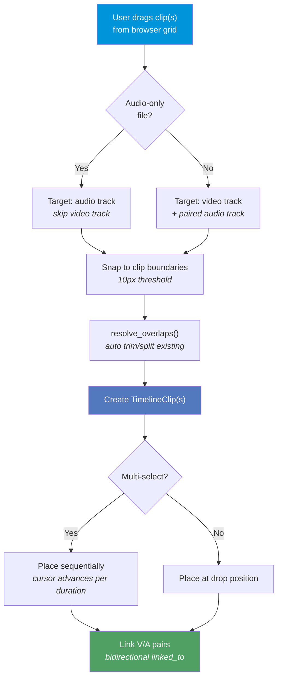

**Drag-to-move:**
- Click + drag clips on the timeline
- Same-track repositioning with automatic overlap resolution
- Cross-track moves (must match track kind: video-to-video, audio-to-audio)
- Linked V/A pairs move together automatically
- 10px snap threshold to clip boundaries

**Trim:**
- 12px hit zone on left/right clip edges
- Drag to adjust source in/out points independently
- Clamped to source clip bounds and 0.1s minimum duration
- Linked clips sync trim state automatically
- Existing clips in the trimmed region are auto-split or auto-trimmed (4 overlap cases handled)

**Overlap Resolution** (called automatically on move/trim/drop):

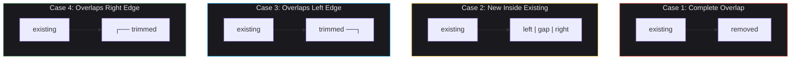

1. Completely overlapped clip → removed
2. New clip inside existing clip → splits existing into two pieces
3. Overlaps left edge → trims existing clip's start
4. Overlaps right edge → trims existing clip's end, adjusts source in-point

### J/K/L Playback State Machine

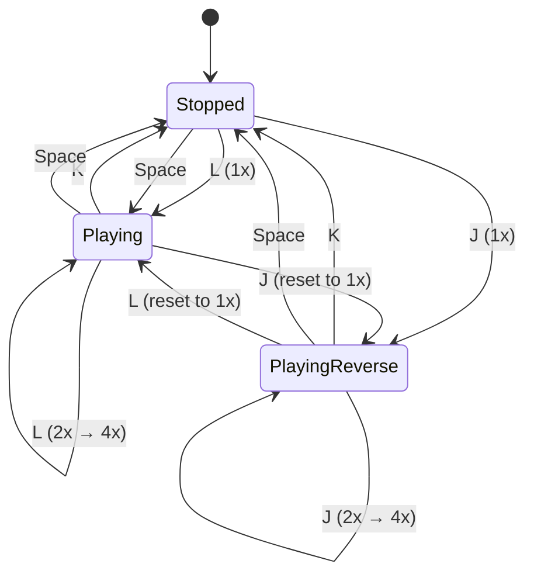

### Zoom & Scroll

- Horizontal zoom: 20–500 pixels/second range
- Zoom-to-pointer: maintains cursor's time position during zoom
- Horizontal scrollbar: draggable, shows visible percentage
- Vertical scroll: for when tracks exceed panel height
- Both scrollbars are custom-rendered (no OS widgets)

---

## Part 3 — Make Them Talk

### State Flows Between Panels

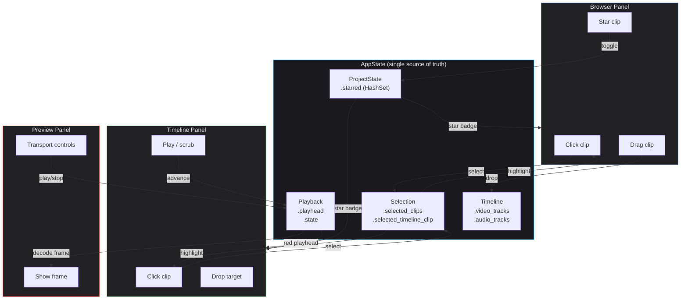

```
Browser                    State                     Timeline
┌────────┐          ┌──────────────┐          ┌────────────┐
│ Click  │──select──►│ Selection    │◄──select──│ Click clip │
│ clip   │          │ .selected_   │          │ on track   │
│        │          │  clips       │          │            │
│        │          │ .selected_   │          │            │
│        │          │  timeline_   │          │            │
│        │          │  clip        │          │            │
└────────┘          └──────────────┘          └────────────┘
                           │
                    ┌──────┴──────┐
                    ▼             ▼
              Browser shows   Timeline shows
              accent border   accent border
              on selected     on selected
              clips           clip

Browser                    State                     Preview
┌────────┐          ┌──────────────┐          ┌────────────┐
│ Star   │──toggle──►│ ProjectState │          │ Shows      │
│ clip   │          │ .starred     │──read────►│ star badge │
│        │          │ (HashSet)    │          │ on clips   │
└────────┘          └──────────────┘          └────────────┘

Timeline                   State                     Preview
┌────────┐          ┌──────────────┐          ┌────────────┐
│ Play   │──advance─►│ Playback     │          │ Decode     │
│ head   │          │ .playhead    │──read────►│ frame at   │
│ moves  │          │ .state       │          │ playhead   │
└────────┘          └──────────────┘          └────────────┘
```

The key insight: **state is the single source of truth**. Both panels read from the same `AppState`. The browser doesn't "tell" the timeline about a star — it toggles `ProjectState.starred`, and the timeline reads from that same set on the next frame.

Selection works the same way: clicking a timeline clip sets `Selection.selected_timeline_clip`, which maps back to a `source_id` (library ClipId). The browser highlights any clip whose ClipId is in the selection set.

---

## Bonus Features

### GPU-Accelerated Waveform Rendering

Custom wgpu render pipeline, not CPU-drawn rectangles:

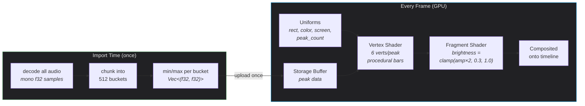

```
Storage Buffer (peaks)     Vertex Shader              Fragment Shader
┌───────────────┐    ┌──────────────────┐    ┌─────────────────────┐
│ [(min,max),   │    │ 6 vertices per   │    │ brightness =        │
│  (min,max),   │───►│ peak (bar rect)  │───►│   clamp(amp*2, 0.3, │
│  (min,max),   │    │ + 6 for bg rect  │    │         1.0)        │
│  ...]         │    │ position from    │    │ color * brightness  │
│               │    │ uniforms + data  │    │ alpha blend         │
└───────────────┘    └──────────────────┘    └─────────────────────┘
```

Uniforms pass clip rect bounds, colors, screen size, and peak count. The vertex shader procedurally generates bar geometry — no vertex buffer needed. Amplitude modulates brightness in the fragment shader, giving a natural "louder = brighter" visual.

Falls back to CPU bar rendering if wgpu is unavailable.

### Dark Professional Theme

15+ named color constants in `theme.rs`:

| Token | Hex | Usage |
|-------|-----|-------|
| `BG_DARK` | `#1a1a1e` | App background |
| `BG_PANEL` | `#212124` | Panel backgrounds |
| `BG_SURFACE` | `#2a2a2e` | Cards, surfaces |
| `ACCENT` | `#0095da` | Selection, interactive elements |
| `CLIP_VIDEO` | `#5278be` | Video clips (blue) |
| `CLIP_AUDIO` | `#50a064` | Audio clips (green) |
| `PLAYHEAD_COLOR` | `#eb4034` | Playhead line + ruler head |
| `STAR_COLOR` | `#ffc832` | Star badges |
| `WAVEFORM_COLOR` | `rgba(120,200,255,230)` | Waveform bars |

Consistent 4px rounding, dark-on-dark hierarchy, and muted secondary text. Styled to feel like Resolve or Premiere — not a toy.

### Clip Trimming

Full in/out point trimming with linked clip synchronization:

```
Before trim:
┌────────────────────────────────────┐
│ clip_a  [source_in=0.0, out=5.0]  │
└────────────────────────────────────┘

After dragging right edge left:
┌──────────────────────┐
│ clip_a  [in=0.0,     │
│          out=3.5]    │
└──────────────────────┘

After dragging left edge right:
        ┌───────────────┐
        │ clip_a         │
        │ [in=1.2,       │
        │  out=3.5]      │
        └───────────────┘
```

Trimming adjusts `source_in`/`source_out` (what part of the source file is used) and `timeline_start`/`duration` (where it sits on the timeline). If the clip has a linked audio/video pair, both sync automatically.

---

## Beyond the Brief

Features implemented that weren't asked for:

### Reverse Playback Engine
Full reverse playback via J key — not just "play backward from playhead," but a dedicated `ReversePipelineHandle` that:
- Decodes 4-second GOP windows in reverse
- Reverses frame order within each window
- Paces frames with distance-based timing
- Supports 1x/2x/4x reverse speed
- Includes stall detection and recovery

### Shadow Pipeline (Gapless Clip Transitions)
When the playhead is within 2 seconds of a clip boundary during forward playback, a shadow pipeline pre-starts the next clip's decoder. When the boundary is reached:
1. Shadow promotes to primary pipeline
2. Buffered first frame is uploaded immediately
3. Pre-decoded audio sources are spliced in
4. No decode startup gap visible to the user

### Multi-Source Audio Mixer
`AudioMixer` combines N audio sources in real-time:
- Lock-free ring buffer per source (16,384 samples, ~341ms at 48kHz)
- Summation with [-1.0, 1.0] soft clamping
- Handles stalls gracefully (log once, don't spam)
- Supports playback audio + scrub previews + hover audio simultaneously

### Live Folder Watching
After importing a folder, the app monitors it with `notify` (macOS FSEvents). Drop a new video file into the folder and it appears in the browser automatically — no re-import needed.

### Multi-Select Everything
- Cmd+Click to toggle individual clips in browser
- Shift+Click for range selection
- Multi-select drag to timeline (clips placed sequentially)
- Drag count badge on cursor

### Clip Renaming
Right-click context menu includes inline rename — type a custom display name without touching the file.

### Tag System
4 semantic tags (B-Roll, VO, Music, SFX) stored as a bitmask per clip. Filter by tag in the browser toolbar. Tags are part of the search haystack, so typing "broll" in search finds tagged clips.

### Audio-Only File Support
Audio files (wav, mp3, flac, etc.) are first-class citizens:
- Music note placeholder instead of thumbnail
- Route to audio tracks on timeline drop (skip video track)
- Waveform rendering works identically
- `no_audio_paths` tracking prevents repeated decode attempts on files that fail

### Stall Detection & Recovery
Multi-layered system to keep something on screen even when decode can't keep up:

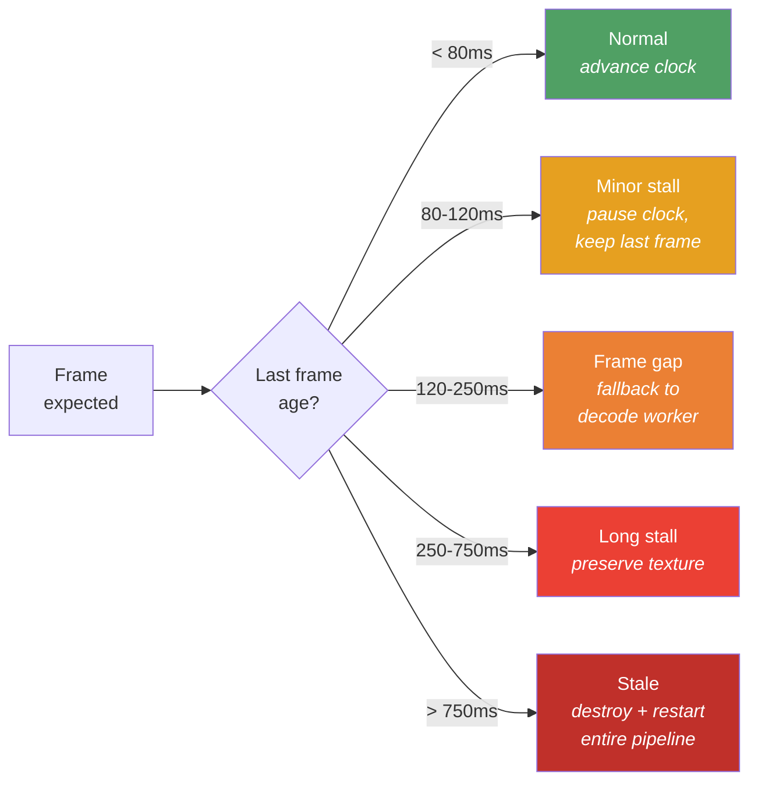

| Layer | Threshold | Action |
|-------|-----------|--------|
| Startup grace | 0.22s | Wait for first frame without intervening |
| Minor stall | 0.08s | Pause clock advance, keep last frame |
| Frame gap | 0.12s | Fall back to video decode worker |
| Long stall | 0.25s | Preserve existing texture |
| Stale pipeline | 0.75s | Destroy and restart entire pipeline |

### Request Bucketing (Deduplication)
Hover audio, scrub audio, and video decode requests are bucketed by time to prevent flooding background threads:
- Hover audio: 2 Hz (one request per 500ms)
- Scrub audio: 10 Hz (one request per 100ms)
- Video decode: 60 Hz (one request per frame)

### LRU Frame Cache
The video decode worker maintains a 64-frame LRU cache. Scrubbing back and forth over the same region serves frames from cache instead of re-decoding — instant response on repeated seeks.

### Track Management
- Dynamic add/remove of V/A track pairs (minimum 1)
- Reorder track pairs (move up/down via context menu)
- Per-track mute (audio) and hide (video) toggles
- Muted tracks are visually dimmed

### PTS Offset Mapping
Source video files have arbitrary PTS (presentation timestamp) values from their codec. The pipeline computes a dynamic `pts_offset` on the first decoded frame to map source timestamps into timeline coordinates. This handles files with non-zero start times, variable frame rates, and codec-specific timestamp schemes.

---

## Threading Model

```
┌─────────────────────────────────────────────────────────────────────┐
│                         Main Thread (60fps)                          │
│                                                                      │
│  handle_keyboard()                                                   │
│       │                                                              │
│       ▼                                                              │
│  advance playhead (dt * speed)                                       │
│       │                                                              │
│       ▼                                                              │
│  manage_pipeline() ─── start/stop/restart forward/reverse/shadow     │
│       │                                                              │
│       ▼                                                              │
│  poll_background_tasks() ─── try_recv all channels (non-blocking)    │
│       │                         │  thumbnails                        │
│       │                         │  metadata                          │
│       │                         │  preview frames                    │
│       │                         │  waveform peaks                    │
│       │                         │  pipeline frames (fwd + rev)       │
│       │                         │  shadow frames                     │
│       │                         │  video decode (fallback)           │
│       │                         │  audio snippets                    │
│       │                         └─ GPU texture upload on receipt      │
│       ▼                                                              │
│  mixer.mix_tick() ─── combine audio sources → cpal output            │
│       │                                                              │
│       ▼                                                              │
│  egui layout + paint ─── browser, timeline, preview panels           │
│       │                                                              │
│       ▼                                                              │
│  wgpu present (vsync)                                                │
└──────────────────────────────────────────────────────────────────────┘

┌─────────────────────────────────────────────────────────────────────┐
│                       Background Threads                             │
│                                                                      │
│  Import (1 per file):        Preview Pool (3 workers):               │
│    metadata → meta_tx          coordinator → priority queue          │
│    thumbnail → thumb_tx        workers → 32 frames/clip → result_rx  │
│    waveform → waveform_tx                                            │
│                              Video Decode (1 thread):                │
│  Folder Watcher:               LRU cache (64 frames)                │
│    FSEvents → watch_tx         seek or sequential decode             │
│                                → video_decode.result_rx              │
│  Audio Worker (1 thread):                                            │
│    1s mono snippet decode    Pipeline Threads (per clip):            │
│    fade in/out               demuxer → video decoder (StreamClock)  │
│    → audio.snippet_rx                → audio decoder (ringbuf)      │
│                                                                      │
│  cpal Audio Thread:                                                  │
│    pulls from ring buffer consumer, writes to hardware               │
└──────────────────────────────────────────────────────────────────────┘
```

Every channel uses `try_recv()` on the main thread — **never blocking**. Background threads block on `recv()` when idle (zero CPU when nothing to do).

### Thread Inventory

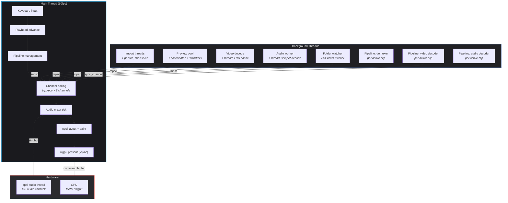

---

## Playback Pipeline Deep Dive

### Forward Playback

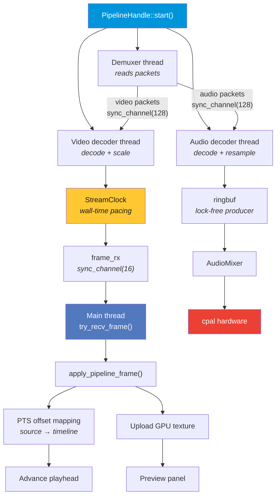

```
                    PipelineHandle::start()
                           │
               ┌───────────┼───────────┐
               ▼           ▼           ▼
          Demuxer     Video Decoder  Audio Decoder
          thread      thread         thread
               │           │           │
          reads        decodes     decodes
          packets      + scales    + resamples
               │           │           │
               │      StreamClock      │
               │      paces output     │
               │           │           │
               │           ▼           ▼
               │      frame_rx      ringbuf
               │      (sync_ch      (lock-free
               │       cap=16)      producer)
               │           │           │
               └───────────┴───────────┘
                           │
                    Main thread
                    try_recv_frame()
                           │
                    apply_pipeline_frame()
                           │
                    ┌──────┴──────┐
                    ▼             ▼
              PTS offset    Upload GPU
              mapping       texture
                    │             │
                    ▼             ▼
              Advance        Preview
              playhead       panel
```

**StreamClock** synchronizes decode speed to wall-clock time:
- Records `(start_time, start_pts)` on construction
- For each frame: computes `expected_pts = start_pts + elapsed * speed`
- If frame is ahead of expected: `sleep(diff / speed)`
- Speed changes rebase the clock without dropping frames

### Reverse Playback

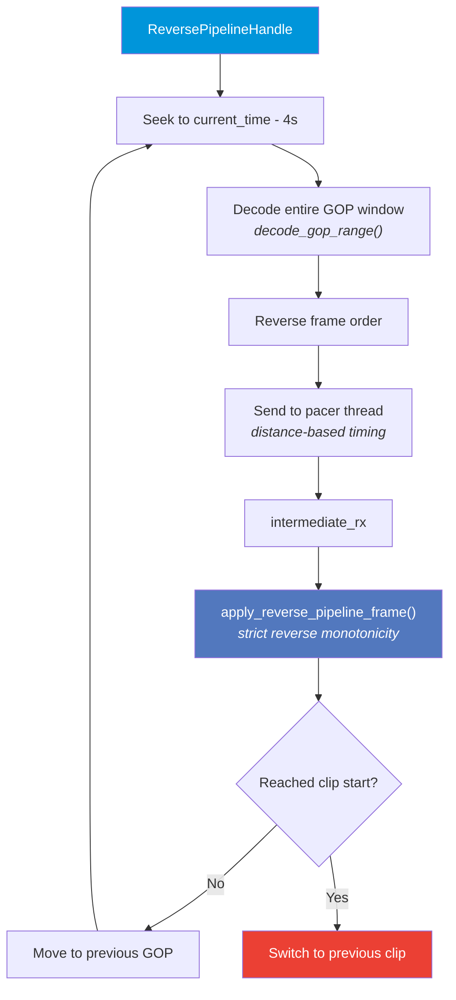

```
ReversePipelineHandle
       │
       ▼
  Decode 4s GOP window
  ending at current time
       │
       ▼
  Reverse frame order
       │
       ▼
  Send to pacer thread
  (distance-based timing)
       │
       ▼
  intermediate_rx
       │
       ▼
  apply_reverse_pipeline_frame()
  (strict reverse monotonicity)
       │
       ▼
  Move to previous GOP
  Repeat
```

### Shadow Pipeline (Gapless Transitions)

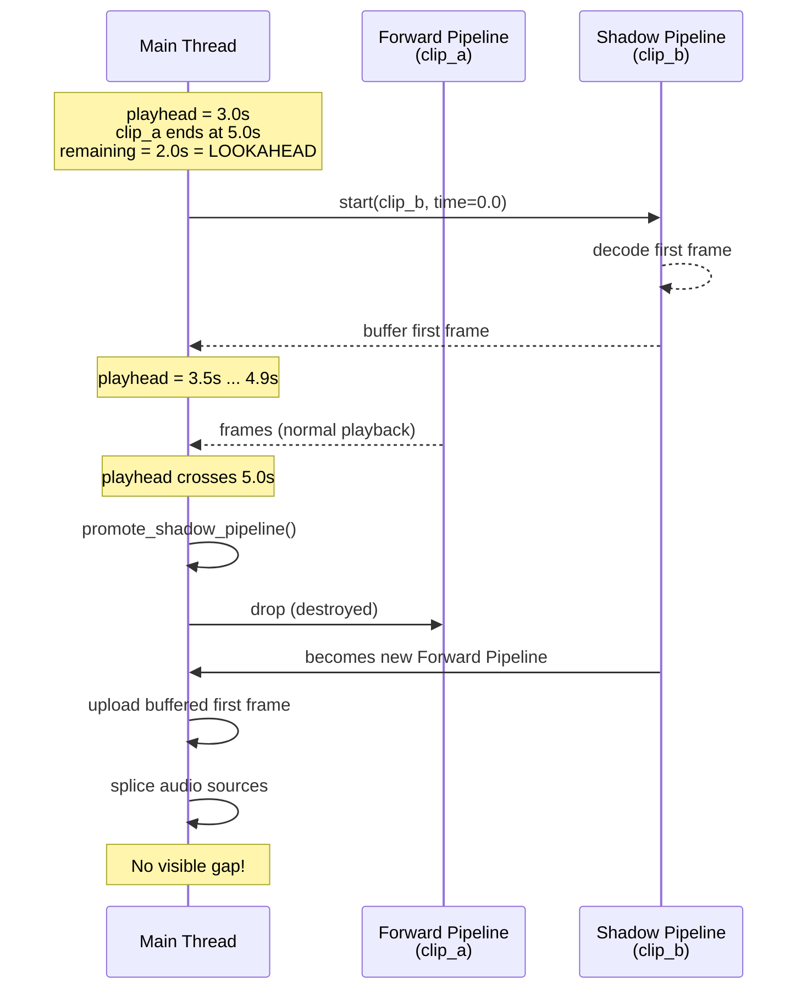

```
Timeline:  ┌──── clip_a ────┐┌──── clip_b ────┐
           0s              5s 5s              10s
                        ▲
                   playhead = 3s
                   remaining = 2s
                   SHADOW_LOOKAHEAD = 2s
                        │
                        ▼
              Shadow pipeline starts for clip_b
              Buffers first frame
              Pre-starts audio sources
                        │
                   playhead = 5s
                        │
                        ▼
              promote_shadow_pipeline()
              Shadow → Forward (instant)
              Buffered frame displayed
              Audio sources spliced in
              No visible gap
```

---

## Audio System Architecture

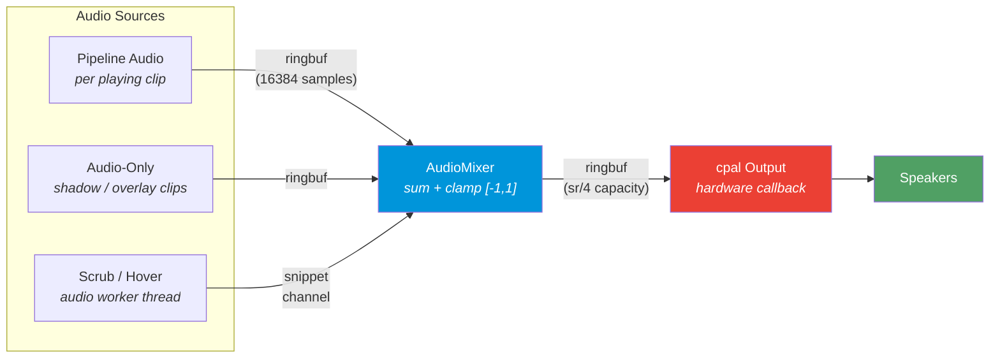

```
┌──────────────────────────────────────────────────────────────┐
│                     Audio Sources                             │
│                                                              │
│  Pipeline Audio ──► ringbuf ──┐                              │
│  (per playing clip)           │                              │
│                               ▼                              │
│  Audio-Only ──► ringbuf ──► AudioMixer ──► ringbuf ──► cpal │
│  (shadow clips)               ▲              (sum +          │
│                               │               clamp)         │
│  Scrub/Hover ──► snippet ─────┘                              │
│  (audio worker)  channel                                     │
│                                                              │
└──────────────────────────────────────────────────────────────┘
```

- **Lock-free ring buffers** (ringbuf crate) between all threads — no mutex contention in the audio hot path
- cpal callback: `try_pop()` from consumer, `0.0` on empty (silence, no blocking)
- `swap_buffer()` atomically replaces the ring buffer on pipeline transitions (prevents stale audio)
- Graceful degradation: if audio device unavailable, dummy producer created, app runs silently

---

## 60fps Frame Budget

Target: **16.6ms** per frame (Fifo/vsync present mode).

```
┌─────────────────────────────────────────────────────┐
│ 0ms                                         16.6ms  │
│ ├──┤ input + keyboard        (< 1ms)               │
│     ├──┤ playhead advance     (< 1ms)               │
│         ├──┤ pipeline mgmt    (< 1ms)               │
│             ├────┤ channel poll (1-3ms)              │
│                   ├──┤ mixer    (< 1ms)              │
│                       ├────┤ egui layout (1-3ms)    │
│                             ├──────┤ GPU render      │
│                                     (3-5ms)         │
│                                          ├───┤      │
│                                          headroom   │
│                                          (5-9ms)    │
└─────────────────────────────────────────────────────┘
```

What keeps it fast:
- **Zero I/O on main thread** — all file reads, decodes, and seeks happen on background threads
- **Non-blocking polls** — `try_recv()` returns immediately if no data
- **Pre-computed data** — waveform peaks are array indexing, not computation
- **GPU texture reuse** — thumbnails uploaded once, referenced by handle
- **Request deduplication** — bucketing prevents redundant decode requests
- **Repaint only when needed** — only calls `ctx.request_repaint()` during playback; otherwise egui repaints only on input events

---

## State Management

```
AppState
├── ProjectState                          (project data)
│   ├── clips: HashMap<ClipId, Clip>      (library of imported media)
│   ├── clip_order: Vec<ClipId>           (insertion order for sorting)
│   ├── starred: HashSet<ClipId>          (favorites)
│   ├── clip_tags: HashMap<ClipId, u32>   (bitmask: B-Roll|VO|Music|SFX)
│   ├── timeline: Timeline                (tracks + clips)
│   │   ├── video_tracks: Vec<Track>
│   │   │   └── clips: Vec<TimelineClip>
│   │   └── audio_tracks: Vec<Track>
│   │       └── clips: Vec<TimelineClip>
│   └── playback: Playback
│       ├── state: Stopped | Playing | PlayingReverse
│       ├── playhead: f64 (seconds)
│       └── speed: f64
│
└── UiState                               (UI-only, no business logic)
    ├── browser: BrowserUiState
    │   ├── search_query, sort_mode, filters
    │   └── hover state, rename state
    ├── timeline: TimelineUiState
    │   ├── zoom, scroll offsets
    │   └── drag state, trim state, scrub state
    ├── selection: Selection
    │   ├── selected_clips (browser)
    │   └── selected_timeline_clip
    └── debug: DebugUiState
        ├── show_fps, ui_fps, video_fps
```

### Clip Lifecycle

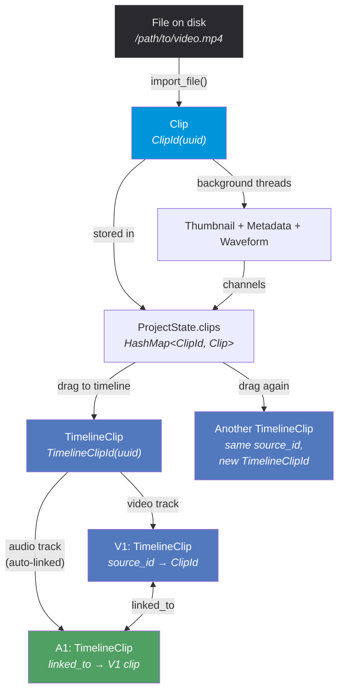

### Type Safety

Three distinct newtype IDs prevent mixing up references:

```rust
ClipId(Uuid)          // Library clip (imported media file)
TrackId(Uuid)         // Timeline track (V1, A2, etc.)
TimelineClipId(Uuid)  // Instance of a clip on the timeline
```

A single library clip (`ClipId`) can appear on the timeline multiple times as different `TimelineClipId` instances. Each timeline clip references its source via `source_id: ClipId`.

### Linked Clips

When a video clip is added to a track, its audio is automatically placed on the paired audio track and linked:

```
V1: ┌── TimelineClip { id: tc_1, source_id: clip_a, linked_to: tc_2 } ──┐
A1: └── TimelineClip { id: tc_2, source_id: clip_a, linked_to: tc_1 } ──┘
```

Moving or trimming either clip automatically syncs the other.

---

## Building & Running

```bash
# Prerequisites
# - Rust (via rustup)
# - ffmpeg (brew install ffmpeg)

# Development
cargo build
cargo run

# Release (real performance numbers)
cargo run --release

# Lint
cargo clippy

# Format
cargo fmt
```

Runs on Apple Silicon (M-series Mac) with Metal backend via wgpu. Window opens at 1400x900 (minimum 800x600).

---

## Tech Stack

| Layer | Technology | Why |
|-------|-----------|-----|
| **Language** | Rust | Memory safety without GC, zero-cost abstractions, single codebase for Mac + Windows |
| **UI Framework** | egui 0.31 | Immediate-mode GPU-rendered UI, no native widgets, cross-platform |
| **GPU Backend** | wgpu 24 (Metal) | Cross-platform GPU abstraction, compiles to Metal on macOS, Vulkan on Windows |
| **Window** | eframe 0.31 | egui's window/event loop integration |
| **Video Decode** | ffmpeg-the-third | Rust bindings to FFmpeg — supports every codec |
| **Audio Output** | cpal 0.15 | Cross-platform audio device access |
| **Audio Buffers** | ringbuf 0.4 | Lock-free SPSC ring buffers for audio threading |
| **File Dialogs** | rfd 0.15 | Native OS file picker dialogs |
| **File Watching** | notify 7 | FSEvents on macOS for live folder monitoring |
| **IDs** | uuid 1 | Unique identifiers for clips, tracks, timeline instances |
| **Image** | image 0.25 | RGBA image handling between decode and GPU upload |
| **GPU Interop** | bytemuck 1 | Safe casting for GPU buffer data |

### Why Rust, Not Swift

The brief suggested Swift. We chose Rust because:

1. **Cross-platform from day one** — the same codebase compiles to macOS (Metal) and Windows (Vulkan/DX12) with zero platform-specific code. Swift locks you to Apple.
2. **wgpu is Rust-native** — Wizard's production stack is Rust + wgpu. Building in Rust means the test project architecture maps 1:1 to the real product.
3. **Fearless concurrency** — the threading model (7+ background threads, lock-free ring buffers, channel-based communication) is exactly where Rust's ownership system shines. No data races, no use-after-free, no GC pauses.
4. **Performance predictability** — no garbage collector means no frame-time spikes. The 16.6ms budget is ours to manage, not the runtime's.
5. **egui over AppKit/UIKit** — immediate-mode rendering means the UI is just draw commands each frame. Adding a fourth panel is adding a function call, not wiring up a view controller hierarchy.

The architecture ports to Windows by changing one line: the wgpu backend selection. Everything else — state, UI, media, audio — is platform-agnostic.
